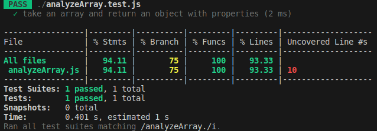
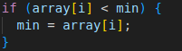
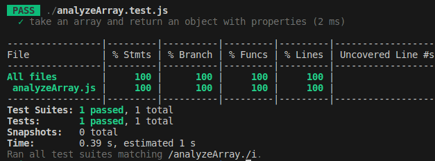
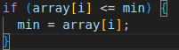

Small jest practice exercises:

- A `capitalize` function that takes a string and returns it with the first character capitalized.
- A `reverseString` function that takes a string and returns it reversed.
- A `calculator object` that contains functions for the basic operations: `add`, `subtract`, `divide`, and `multiply`. Each of these functions should take two numbers and return the correct calculation.
- A `caesarCipher` function that takes a `string` and a `shift factor` and returns it with each character “shifted”
- An `analyzeArray` function that takes an array of numbers and returns an object with the following properties: average, min, max, and length.

-const `object` = analyzeArray([1,8,3,4,2,6]);

`object` == {
  `average`: 4,
  `min`: 1,
  `max`: 8,
  `length`: 6
};`

Experiences:
Jest is a really great way to write clean code 😊
- while building my `analyzeArray` function i consoled everything well, but after i tested the function Jest was giving me 75% branch and also was pointing at the `7-8 lines`. After researching how to read the test log, I understood the problem and I rechecked my if statements, the second one `min` had a minor problem, simply changed it to <= and finally received a nice 100%!

